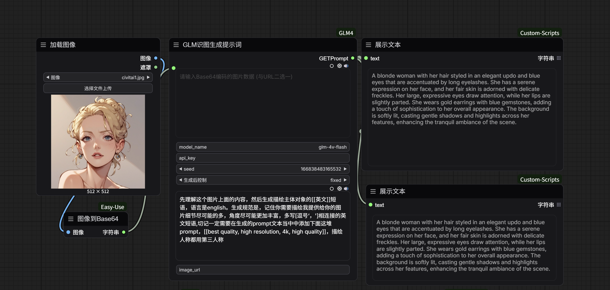
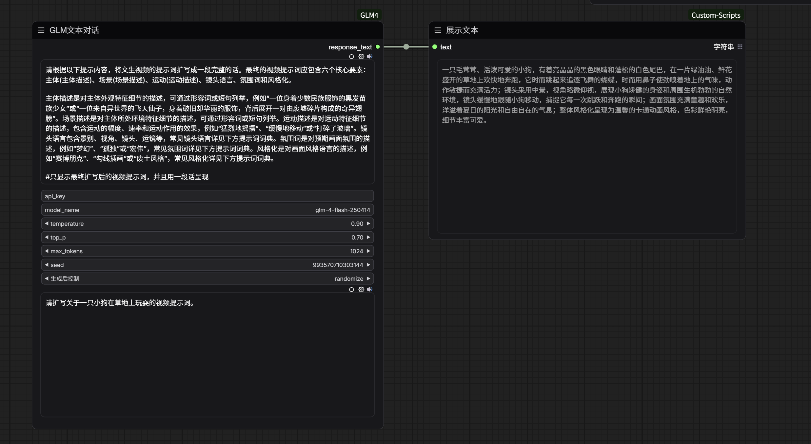

# ComfyUI-GLM4

------




## 简介

**ComfyUI-GLM4** 是一个为 [ComfyUI](https://github.com/comfyanonymous/ComfyUI) 设计的自定义节点，旨在将智谱AI的 [GLM-4 大语言模型](https://open.bigmodel.cn/modelcenter/glm-4) 无缝集成到您的 ComfyUI 工作流中。通过这个节点，您可以直接在 ComfyUI 中利用 GLM-4 强大的文本生成、理解、摘要和推理能力，为您的图像生成、自动化流程等提供智能文本支持。

## 主要特性

*   **简单易用：** 仅需填入您的智谱AI API Key，即可立即开始使用。
*   **深度集成：** 作为 ComfyUI 的原生节点，可与其他节点无缝连接，构建复杂的AI工作流。
*   **强大能力：** 利用 GLM-4 模型提供的高质量文本生成和处理能力。
*   **灵活配置：** 支持配置 GLM-4 的温度（Temperature）、最大生成长度（Max Tokens）等参数，以满足不同需求。

## 安装

1.  **克隆仓库：**
    打开您的 ComfyUI 安装目录下的 `custom_nodes` 文件夹，然后执行以下命令克隆本仓库：
    ```bash
    cd path/to/ComfyUI/custom_nodes
    git clone https://github.com/msola-ht/ComfyUI-GLM4.git
    ```

2.  **安装依赖 (如果需要):**
    本节点可能依赖于智谱AI的 Python SDK。请确保您的 Python 环境中已安装必要的库。通常，您可以在 `ComfyUI-GLM4` 目录下找到 `requirements.txt` 文件，并安装：
    ```bash
    cd ComfyUI-GLM4
    pip install -r requirements.txt
    ```
    *(如果 `requirements.txt` 不存在，通常意味着核心依赖已包含在 ComfyUI 环境中，或者只需安装 `zhipuai` 库：`pip install zhipuai`)*

3.  **重启 ComfyUI：**
    安装完成后，请重启您的 ComfyUI 应用程序，新的节点将会出现在节点列表中。

## 使用方法

1.  **获取智谱AI API Key：**
    *   访问 [智谱AI开放平台](https://open.bigmodel.cn/)。
    *   注册并登录您的账号。
    *   在用户中心或 API Key 管理页面生成您的 API Key。请妥善保管您的 Key。

2.  **在 ComfyUI 中添加 ComfyUI-GLM4 节点：**
    *   启动 ComfyUI。
    *   在工作流中右键点击，选择 `Add Node` -> `ComfyUI-GLM4` (或类似名称)。

3.  **配置 API Key：**
    *   在 ComfyUI-GLM4 节点中，找到名为 `api_key` 的输入框。
    *   将您在智谱AI平台获取到的 API Key 粘贴到此输入框中（替换 `YOUR_ZHIPU_AI_API_KEY_HERE`）。

4.  **连接节点并构建工作流：**
    *   **输入：** 将您的 Prompt（文本输入）连接到 ComfyUI-GLM4 节点的输入端（通常标记为 `text_input` 或 `prompt`）。
    *   **输出：** ComfyUI-GLM4 节点的输出端（通常标记为 `text_output` 或 `generated_text`）将输出 GLM-4 模型生成的文本。您可以将此输出连接到：
        *   一个 `Text` 节点或 `Print Text` 节点以显示结果。
        *   一个 `CLIP Text Encode` 节点，将生成的文本作为图像生成模型的 Prompt。
        *   其他任何需要文本输入的 ComfyUI 节点。

5.  **运行工作流：**
    *   配置好所有连接后，点击 ComfyUI 的 `Queue Prompt` 按钮，GLM-4 模型将开始处理您的请求并生成文本。

## 节点参数

| 参数名称      | 类型    | 描述                                                         | 默认值/示例                  |
| :------------ | :------ | :----------------------------------------------------------- | :--------------------------- |
| `api_key`     | String  | 您的智谱AI API Key。**必填项。**                             | `YOUR_ZHIPU_AI_API_KEY_HERE` |
| `text_input`  | String  | 发送给 GLM-4 模型的用户 Prompt。                             | `请写一个关于未来的短故事。` |
| `model_name`  | String  | 要使用的 GLM 模型名称。目前支持 `glm-4`。                    | `glm-4`                      |
| `temperature` | Float   | 控制生成文本的随机性。值越高，文本越随机（0.0-1.0）。        | `0.95`                       |
| `top_p`       | Float   | 控制生成文本的多样性。值越高，模型考虑的词语越多（0.0-1.0）。 | `0.7`                        |
| `max_tokens`  | Integer | 生成文本的最大长度（以 token 计）。                          | `512`                        |
| `stream`      | Boolean | 是否以流式方式获取响应。设为 `True` 可能有助于实时显示生成过程。 | `False`                      |

## 示例工作流

请参考项目截图中的工作流示例，它们展示了 ComfyUI-GLM4 节点如何与其他 ComfyUI 节点协同工作。

## 贡献

欢迎对本项目进行贡献！如果您有任何建议、Bug 报告或希望添加新功能，请随时提交 Pull Request 或创建 Issue。

## 许可证

本项目遵循 MIT 许可证。详见 `LICENSE` 文件。

---
